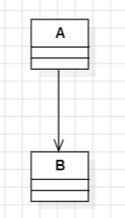
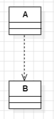
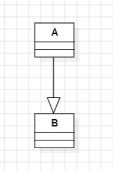

# MIU-MPP-Part1
Maharishi International University 
Modern Programming Practices

## Software Development Life Cycle (SDLC)
1. User Requiments (Analysis)
2. Create a Static Model (Analysis)
3. Add Relationship to the Static Model (Analysis)
4. Create a Dynamic Model (Analysis)
5. Enhance the Static and Dynamic Model (Design)
6. Transform UML Into Code

## UML Diagrams
- Use Case Diagram
- Class Diagram
- Sequence Diagram
- Object Diagram
- ...

> [!NOTE]
At a user requirement text, nouns becomes classes and verbs becomes relationship

## Relationship (UML)
### Associations

- A has a B
- Permanent relationship
- A keeps a reference to B 

### Dependency 

- Temporary relationship
- Dependency does not keep reference between classes

### Inheritance

- A obtain properties and behaviors of B
- A is a type of B