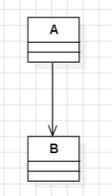
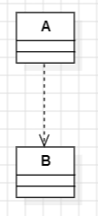
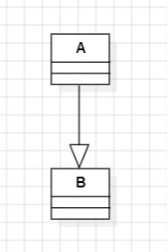

# MIU-MPP-Part1
Maharishi International University 
Modern Programming Practices

## Relationship (UML)
### Associations

- A has a B
- Permanent relationship
- A keeps a reference to B 

### Dependency 

- Temporary relationship
- Dependency does not keep reference between classes

### Inheritance

- A obtain properties and behaviors of B
- A is a type of B